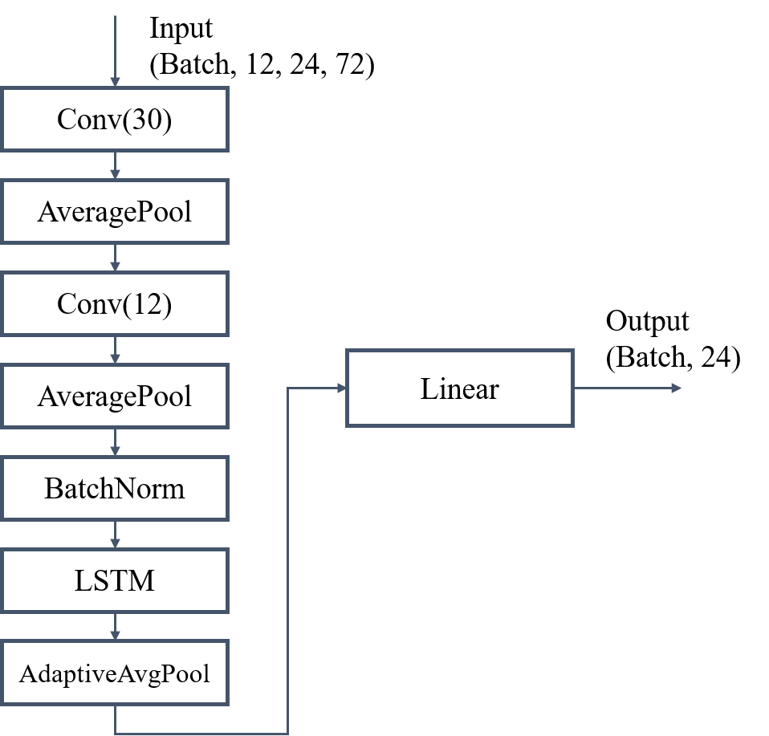

# Problem description

See the official competition website: https://tianchi.aliyun.com/competition/entrance/531871/information

# Requirements

```
netCDF4
xarray
torch==1.7.0
torchvision==0.8.1
numpy==1.19.2
scikit-learn==0.23.1
```

# Solution

A CNN+LSTM based multi-stream model is used here to forecast the *nino3.4* index.
## model structure

## layer


# Rank

season 1: 83 / 2849

season 2: 64 / 2849

